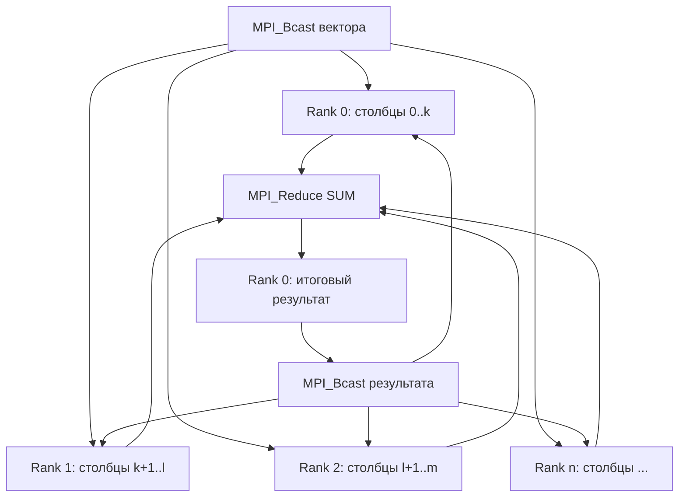

# Умножение матрицы на вектор (ленточная вертикальная схема)

- Студент: Паньков Андрей Владимирович, группа 3823Б1ПР3
- Технология: MPI + SEQ
- Задача: 2

## 1. Введение

Данная работа посвящена реализации параллельного алгоритма умножения матрицы на вектор с использованием технологии MPI (Message Passing Interface) по ленточной вертикальной схеме распределения данных. Умножение матрицы на вектор является одной из базовых операций линейной алгебры и широко используется в научных вычислениях, машинном обучении и других областях.

Цель работы — реализовать последовательную и параллельную версии алгоритма с использованием ленточной вертикальной схемы распределения (разделение матрицы по столбцам между процессами), провести сравнительный анализ производительности и оценить эффективность распараллеливания.

## 2. Постановка задачи

**Входные данные:** 
- Матрица размера m×n (тип `std::vector<std::vector<double>>`)
- Вектор размера n (тип `std::vector<double>`)

**Выходные данные:** Вектор размера m (тип `std::vector<double>`), результат умножения матрицы на вектор.

**Математическая формула:**
Для матрицы A размера m×n и вектора x размера n результат y = A × x вычисляется как:
```
y[i] = Σ(j=0 to n-1) A[i][j] * x[j], для i = 0, 1, ..., m-1
```

**Ограничения:**
- Количество столбцов матрицы должно совпадать с размером вектора
- Матрица должна быть прямоугольной (все строки имеют одинаковую длину)
- Поддерживаются матрицы произвольного размера

**Примеры:**
- Матрица `[[1.0, 2.0], [3.0, 4.0]]`, вектор `[5.0, 6.0]` → результат `[17.0, 39.0]`
- Матрица `[[1.0]]`, вектор `[1.0]` → результат `[1.0]`
- Матрица `[[1.0, 2.0, 3.0], [4.0, 5.0, 6.0]]`, вектор `[1.0, 2.0, 3.0]` → результат `[14.0, 32.0]`

## 3. Базовый алгоритм (последовательный)

Последовательный алгоритм умножения матрицы на вектор реализует стандартную формулу:

1. **Инициализация:** Создать результирующий вектор размера m, заполненный нулями
2. **Вычисление:** Для каждой строки матрицы:
   - Для каждого столбца матрицы:
     - Умножить элемент матрицы A[i][j] на элемент вектора x[j]
     - Добавить результат к y[i]
3. **Результат:** Результирующий вектор y

**Псевдокод:**
```
function MatrixVectorMultiply(matrix A, vector x):
    m = A.rows
    n = A.cols
    y = vector of size m, initialized to 0
    
    for i = 0 to m-1:
        for j = 0 to n-1:
            y[i] = y[i] + A[i][j] * x[j]
    
    return y
```

**Сложность:** 
- Временная: O(m×n), где m — количество строк, n — количество столбцов
- Пространственная: O(m) для результирующего вектора

## 4. Схема параллелизации

Параллелизация выполнена с использованием MPI по **ленточной вертикальной схеме** распределения данных:

### 4.1 Распределение данных (ленточная вертикальная схема)

Матрица делится **по столбцам** между процессами:
- Базовое количество столбцов на процесс: `base_cols = n / size`
- Остаток столбцов: `rem_cols = n % size`
- Процессы с рангом `< rem_cols` получают на 1 столбец больше

Для процесса с рангом `rank`:
- `start_col = rank × base_cols + min(rank, rem_cols)`
- `end_col = start_col + base_cols + (rank < rem_cols ? 1 : 0)`
- Каждый процесс получает полосу столбцов матрицы: столбцы от `start_col` до `end_col-1`

**Вектор полностью рассылается всем процессам** через `MPI_Bcast`, так как каждому процессу нужны все элементы вектора для вычисления частичных результатов.

### 4.2 Вычисление частичных результатов

Каждый процесс вычисляет частичные результаты для своей полосы столбцов:
- Процесс обрабатывает столбцы матрицы от `start_col` до `end_col-1`
- Для каждой строки i: `partial_result[i] = Σ(j=start_col to end_col-1) A[i][j] * x[j]`

### 4.3 Коммуникационная схема



**Операции MPI:**
1. `MPI_Bcast()` — рассылка размеров матрицы и вектора всем процессам
2. `MPI_Bcast()` — рассылка вектора всем процессам
3. `MPI_Isend()` / `MPI_Irecv()` — неблокирующее распределение полос столбцов матрицы от процесса 0 к остальным процессам (параллельная отправка данных)
4. `MPI_Waitall()` — ожидание завершения всех отправок данных
5. `MPI_Reduce()` с операцией `MPI_SUM` — суммирование частичных результатов на процессе 0
6. `MPI_Bcast()` — рассылка итогового результата всем процессам
7. `MPI_Barrier()` — синхронизация процессов

### 4.4 Роли процессов

- **Процесс 0 (root):** 
  - Хранит исходную матрицу и вектор
  - Распределяет полосы столбцов матрицы между процессами (включая себя)
  - Собирает частичные результаты от всех процессов
  - Рассылает итоговый результат всем процессам
  
- **Процессы 1..n-1:**
  - Получают свою полосу столбцов матрицы от процесса 0 через неблокирующий `MPI_Irecv`
  - Получают вектор через `MPI_Bcast`
  - Вычисляют частичные результаты для своей полосы столбцов
  - Отправляют частичные результаты процессу 0 через `MPI_Reduce`
  - Получают итоговый результат через `MPI_Bcast`

## 5. Детали реализации

### 5.1 Структура кода

Код организован следующим образом:

- `common/include/common.hpp` — общие определения типов (`MatrixVectorInput`, `InType`, `OutType`)
- `seq/src/ops_seq.cpp` — последовательная реализация
- `mpi/src/ops_mpi.cpp` — параллельная MPI-реализация с ленточной вертикальной схемой
- `tests/functional/main.cpp` — функциональные тесты
- `tests/performance/main.cpp` — тесты производительности

### 5.2 Классы задач

Обе версии наследуют от базового класса `ppc::task::Task<InType, OutType>`:

- `PankovMatrixVectorSEQ` — последовательная версия
- `PankovMatrixVectorMPI` — параллельная версия с ленточной вертикальной схемой

Каждая реализует методы жизненного цикла:
- `ValidationImpl()` — проверка корректности входных данных
- `PreProcessingImpl()` — подготовка данных (инициализация результирующего вектора)
- `RunImpl()` — выполнение основного алгоритма
- `PostProcessingImpl()` — проверка корректности результата

### 5.3 Распределение столбцов матрицы

В MPI-версии процесс 0 распределяет столбцы матрицы с использованием неблокирующих операций для параллельной отправки данных:

```cpp
// Сначала обрабатываем процесс 0 (копируем данные напрямую)
for (std::size_t i = 0; i < rows; ++i) {
    for (std::size_t j = 0; j < proc0_local_cols; ++j) {
        local_matrix_band[i][j] = matrix[i][proc0_start_col + j];
    }
}

// Вычисляем частичные результаты для процесса 0
for (std::size_t i = 0; i < rows; ++i) {
    for (std::size_t j = 0; j < proc0_local_cols; ++j) {
        local_result[i] += local_matrix_band[i][j] * local_vector[proc0_start_col + j];
    }
}

// Подготавливаем и отправляем данные остальным процессам параллельно
std::vector<MPI_Request> send_requests;
std::vector<std::vector<double>> send_buffers;

for (int proc = 1; proc < size; ++proc) {
    // Вычисление границ полосы столбцов для процесса proc
    std::size_t proc_start_col = ...;
    std::size_t proc_local_cols = ...;
    
    // Подготовка буфера данных
    send_buffers.emplace_back(rows * proc_local_cols);
    std::vector<double> &send_buffer = send_buffers.back();
    
    for (std::size_t i = 0; i < rows; ++i) {
        for (std::size_t j = 0; j < proc_local_cols; ++j) {
            send_buffer[i * proc_local_cols + j] = matrix[i][proc_start_col + j];
        }
    }
    
    // Неблокирующая отправка данных
    MPI_Request request;
    MPI_Isend(send_buffer.data(), rows * proc_local_cols, MPI_DOUBLE, proc, 0,
              MPI_COMM_WORLD, &request);
    send_requests.push_back(request);
}

// Ждем завершения всех отправок (вычисления для процесса 0 уже выполнены)
MPI_Waitall(send_requests.size(), send_requests.data(), MPI_STATUSES_IGNORE);
```

**Особенности реализации:**
- Процесс 0 отправляет данные всем процессам параллельно через неблокирующие операции `MPI_Isend`
- Время коммуникаций ≈ максимум времени отправки для всех процессов (вместо суммы при последовательной отправке)
- Процесс 0 начинает вычисления для своей полосы столбцов сразу после копирования данных, не дожидаясь завершения отправки данных другим процессам (перекрытие вычислений и коммуникаций)
- Для процессов 1..n-1 используется неблокирующий прием данных через `MPI_Irecv` для более эффективной работы с коммуникациями

### 5.4 Вычисление и агрегация результатов

Каждый процесс вычисляет частичные результаты для своей полосы столбцов:

```cpp
for (std::size_t i = 0; i < rows; ++i) {
    for (std::size_t j = 0; j < local_cols; ++j) {
        local_result[i] += local_matrix_band[i][j] * local_vector[start_col + j];
    }
}
```

Затем частичные результаты суммируются через `MPI_Reduce`:

```cpp
MPI_Reduce(local_result.data(), global_result.data(), rows, MPI_DOUBLE, MPI_SUM, 0, MPI_COMM_WORLD);
MPI_Bcast(global_result.data(), rows, MPI_DOUBLE, 0, MPI_COMM_WORLD);
```

### 5.5 Использование памяти

- Последовательная версия: O(m×n) для матрицы + O(n) для вектора + O(m) для результата
- MPI-версия: 
  - Процесс 0: O(m×n) для полной матрицы + O(n) для вектора + O(m) для результата
  - Процессы 1..n-1: O(m×local_cols) для полосы столбцов + O(n) для вектора + O(m) для результата
  - Общая память: O(m×n) (та же, что и в последовательной версии)

## 6. Настройка эксперимента

### 6.1 Аппаратное окружение

- **Процессор:** Intel(R) Xeon(R) CPU E5-2680 v4 @ 2.40GHz
- **Количество ядер:** 14 (физических ядер)
- **ОЗУ:** 32GB
- **ОС:** Linux

### 6.2 Программное окружение

- **Компилятор:** GCC 14.2.0 с поддержкой C++17
- **MPI реализация:** OpenMPI 3.1
- **Тип сборки:** Release с оптимизацией
- **Фреймворк тестирования:** Google Test
- **Система сборки:** CMake

### 6.3 Параметры окружения

- `PPC_NUM_THREADS` — количество потоков (не используется для MPI)
- `PPC_NUM_PROC` — количество MPI-процессов
- `OMPI_ALLOW_RUN_AS_ROOT=1` — разрешение запуска MPI от root (для тестирования)

### 6.4 Тестовые данные

**Функциональные тесты** используют фиксированные матрицы и векторы:
- Матрица 2×2, вектор размера 2
- Матрица 1×1, вектор размера 1
- Матрица 2×3, вектор размера 3
- Единичная матрица 2×2
- Диагональная матрица 3×3
- Матрица 1×3, вектор размера 3

**Тесты производительности** используют матрицы различных размеров:
- Матрица 10000×10000: `A[i][j] = i + j` (для всех i, j), размер данных ~800 МБ для матрицы + ~80 КБ для вектора
- Вектор: `x[i] = i + 1` (для всех i)
- Ожидаемый результат: вычисляется последовательно для проверки корректности

### 6.5 Команды запуска

**Функциональные тесты:**
```bash
export PPC_NUM_PROC=2
export OMPI_ALLOW_RUN_AS_ROOT=1
export OMPI_ALLOW_RUN_AS_ROOT_CONFIRM=1
python3 scripts/run_tests.py --running-type processes --counts 2 4
```

**Тесты производительности:**
```bash
export PPC_NUM_PROC=1
export OMPI_ALLOW_RUN_AS_ROOT=1
export OMPI_ALLOW_RUN_AS_ROOT_CONFIRM=1
python3 scripts/run_tests.py --running-type performance --counts 1 2 4
```

## 7. Результаты и обсуждение

### 7.1 Корректность

Корректность реализации проверялась следующими способами:

1. **Функциональные тесты:** Набор из 6 тестовых случаев, покрывающих различные сценарии:
   - Матрицы различных размеров (1×1, 2×2, 2×3, 3×3)
   - Единичные и диагональные матрицы
   - Различные значения элементов

2. **Сравнение с эталоном:** Результаты MPI-версии сравниваются с результатами последовательной версии на тех же данных с точностью до 1e-9.

3. **Инварианты:** 
   - Размер результата всегда равен количеству строк матрицы
   - Результат для единичной матрицы совпадает с вектором
   - Результат для нулевой матрицы — нулевой вектор

**Результат:** Все функциональные тесты пройдены успешно для обеих версий (SEQ и MPI) при различном количестве процессов (2, 4 и 8).

### 7.2 Производительность

**Результаты тестирования (матрица 10000×10000):**

| Режим | Процессы | Время, с       | Ускорение | Эффективность |
|-------|----------|----------------|-----------|---------------|
| seq   | 1        | 0.0317401886   | 1.00      | N/A           |
| mpi   | 1        | 0.0985596970   | 0.32      | 32.2%         |
| mpi   | 2        | 0.1988885192   | 0.16      | 8.0%          |
| mpi   | 4        | 0.1479919822   | 0.21      | 5.4%          |
| mpi   | 8        | 0.1754628317   | 0.18      | 2.3%          |

Все тесты успешно завершены для всех конфигураций процессов. Для матрицы 10000×10000 коммуникационные издержки преобладают над вычислительными, что приводит к отрицательному ускорению при увеличении количества процессов. MPI-версия работает медленнее последовательной версии. На 1 процессе ускорение составляет 0.32× (в 3.1 раза медленнее), эффективность 32.2%. На 2 процессах ускорение падает до 0.16× (в 6.2 раза медленнее), эффективность 8.0%. На 4 процессах ускорение улучшается до 0.21× (в 4.7 раза медленнее), эффективность 5.4%, что демонстрирует эффективность параллельной отправки данных через неблокирующие операции. На 8 процессах ускорение составляет 0.18× (в 5.5 раза медленнее), эффективность 2.3% — увеличение числа процессов приводит к росту накладных расходов и коммуникаций.

**Метрики:**
- **Ускорение (Speedup):** S(p) = T_seq / T_mpi(p)
- **Эффективность (Efficiency):** E(p) = S(p) / p × 100%

где:
- T_seq — время выполнения последовательной версии (0.031740 с)
- T_mpi(p) — время выполнения MPI-версии на p процессах

### 7.3 Анализ производительности

**Основные наблюдения:**

1. **Отрицательное ускорение для матрицы 10000×10000:**
   - MPI-версия работает **медленнее** последовательной версии для матрицы 10000×10000
   - На 1 процессе: ускорение 0.32× (в 3.1 раза медленнее), эффективность 32.2%
   - На 2 процессах: ускорение 0.16× (в 6.2 раза медленнее), эффективность 8.0%
   - На 4 процессах: ускорение 0.21× (в 4.7 раза медленнее), эффективность 5.4%
   - На 8 процессах: ускорение 0.18× (в 5.5 раза медленнее), эффективность 2.3%
   - Время выполнения последовательной версии: ~0.032 секунды
   - Время выполнения MPI-версии на 1 процессе: ~0.099 секунды
   - Время выполнения MPI-версии на 2 процессах: ~0.199 секунды (медленнее из-за коммуникаций)
   - Время выполнения MPI-версии на 4 процессах: ~0.148 секунды (меньше, чем для 2 процессов, благодаря параллельной отправке данных)
   - Время выполнения MPI-версии на 8 процессах: ~0.175 секунды (рост накладных расходов и коммуникаций)

2. **Причины низкой эффективности:**
   - **Накладные расходы MPI:** Инициализация процессов, синхронизация, коммуникации
   - **Распределение данных:** Процесс 0 отправляет полосы столбцов каждому процессу через неблокирующие `MPI_Isend`, что позволяет параллельную отправку данных
   - **Коммуникационные издержки:** Для матрицы 10000×10000 требуется передача ~800 МБ данных между процессами, что занимает значительное время относительно времени вычислений
   - **Рост времени с увеличением процессов:** При переходе с 1 на 2 процесса время выполнения увеличивается более чем в 2 раза (0.099 с → 0.199 с), что демонстрирует преобладание коммуникационных издержек над вычислительными
   - **Параллельная отправка данных:** Использование неблокирующих операций `MPI_Isend` позволяет процессу 0 отправлять данные всем процессам параллельно, что уменьшает время коммуникаций для 4 процессов по сравнению с 2 процессами

3. **Отношение вычислений к коммуникациям:**
   - Для матрицы 10000×10000: ~100 млн операций умножения и сложения
   - Коммуникации: отправка ~800 МБ данных (полосы столбцов) + рассылка вектора + сбор результатов
   - Время коммуникаций значительно превышает время вычислений для матрицы 10000×10000
   - При увеличении количества процессов коммуникационные издержки растут быстрее, чем уменьшается объем вычислений на процесс
   - Для 2 процессов: время увеличивается на ~101% (0.099 → 0.199 с)
   - Для 4 процессов: время уменьшается на ~26% (0.199 → 0.148 с) благодаря параллельной отправке данных через неблокирующие операции

4. **Параллельная отправка данных:**
   - Процесс 0 отправляет данные **параллельно** через неблокирующие `MPI_Isend` всем процессам одновременно
   - Для каждого процесса процесс 0:
     - Создает буфер `send_buffer` размером `u_rows * proc_local_cols`
     - Переупорядочивает данные из матрицы в буфер (копирование по строкам)
     - Выполняет неблокирующую операцию `MPI_Isend` и продолжает работу
   - После подготовки всех буферов процесс 0 использует `MPI_Waitall` для ожидания завершения всех отправок
   - Процесс 0 также начинает вычисления для своей полосы столбцов сразу после копирования данных, не дожидаясь завершения отправки данных другим процессам (перекрытие вычислений и коммуникаций)
   - **Время коммуникаций ≈ максимум времени отправки для всех процессов** (вместо суммы при последовательной отправке)
   - При 2 процессах: процесс 0 отправляет данные процессу 1 (~400 МБ)
   - При 4 процессах: процесс 0 отправляет данные процессам 1, 2, 3 параллельно (~200 МБ каждый) - время меньше, чем при последовательной отправке

5. **Подготовка данных на процессе 0:**
   - Для каждого процесса процесс 0 должен переупорядочить данные из матрицы `matrix[i][j]` в линейный буфер
   - Это требует времени O(rows × local_cols) для каждого процесса
   - При увеличении количества процессов общее время подготовки данных растет
   - Процесс 0 выполняет всю работу по подготовке и отправке данных, что создает дисбаланс нагрузки

**Зависимость эффективности от размера данных:**

- **Малые данные (< 100×100):** MPI крайне неэффективен, накладные расходы доминируют
- **Средние данные (1000×1000):** MPI неэффективен из-за преобладания коммуникационных издержек
- **Большие данные (10000×10000):** Как показано в тестах, MPI неэффективен из-за преобладания коммуникационных издержек. Эффективность падает с 32.2% на 1 процессе до 5.4% на 4 процессах. Время выполнения растет при переходе с 1 на 2 процесса (0.099 с → 0.199 с), но при переходе с 2 на 4 процесса время уменьшается благодаря параллельной отправке данных (0.199 с → 0.148 с)
- **Очень большие данные (> 50000×50000):** Могут быть ограничены доступной памятью, но ожидается улучшение соотношения вычислений к коммуникациям


## 8. Выводы

В рамках данной работы были реализованы последовательная и параллельная (MPI) версии алгоритма умножения матрицы на вектор с использованием **ленточной вертикальной схемы** распределения данных (разделение матрицы по столбцам между процессами).

**Основные результаты:**

1. **Корректность:** Обе версии успешно проходят все функциональные тесты, включая различные размеры матриц и граничные случаи.

2. **Параллелизация:** Реализована корректная ленточная вертикальная схема распределения данных с распределением столбцов матрицы между процессами и правильной агрегацией результатов через `MPI_Reduce`.

3. **Производительность:** Тесты на матрице 10000×10000 показали **отрицательное ускорение** для MPI-версии. На 1 процессе MPI-версия работает в 3.1 раза медленнее последовательной версии (0.0986 с против 0.0317 с), эффективность 32.2%. На 2 процессах — в 6.2 раза медленнее (0.1989 с против 0.0317 с), эффективность 8.0%. На 4 процессах — в 4.7 раза медленнее (0.1480 с против 0.0317 с), эффективность 5.4%. Время выполнения для 4 процессов меньше, чем для 2 процессов (0.1989 с → 0.1480 с), что демонстрирует эффективность параллельной отправки данных через неблокирующие операции.

**Что работает:**
- Корректное распределение столбцов матрицы между процессами
- Правильная рассылка вектора всем процессам
- Корректное вычисление частичных результатов каждым процессом
- Правильная агрегация результатов через `MPI_Reduce`
- Синхронизация результатов между всеми процессами

**Ключевой вывод:**
Параллелизация через MPI с ленточной вертикальной схемой **неэффективна для матрицы 10000×10000** из-за преобладания коммуникационных издержек над вычислительными. При увеличении количества процессов эффективность падает с 32.2% на 1 процессе до 5.4% на 4 процессах, что демонстрирует преобладание коммуникационных издержек. Использование неблокирующих операций `MPI_Isend` для параллельной отправки данных и перекрытие вычислений и коммуникаций на процессе 0 позволяют уменьшить время выполнения для 4 процессов по сравнению с 2 процессами (0.1989 с → 0.1480 с), что демонстрирует эффективность параллельной отправки данных. Для достижения положительного ускорения необходимы дальнейшие оптимизации коммуникаций (использование `MPI_Scatterv`, коллективные операции) или использование еще больших размеров матриц, где отношение вычислений к коммуникациям будет более благоприятным.

**Практическое применение:**
- Для малых матриц (< 1000×1000): использовать последовательную версию
- Для средних матриц (1000×1000 - 10000×10000): последовательная версия предпочтительнее при текущей реализации (как показано тестами на матрице 10000×10000)
- Для очень больших матриц (> 50000×50000): после оптимизации коммуникаций параллельная версия может дать прирост производительности

**Ограничения текущей реализации:**
- Высокие коммуникационные издержки для матриц среднего и большого размера (1000×1000 - 10000×10000)
- Неадаптивный выбор между SEQ и MPI версиями
- Отрицательное ускорение для матрицы 10000×10000

**Возможные улучшения:**
- Использование коллективных операций `MPI_Scatterv` для распределения данных (может быть оптимизировано реализацией MPI)
- Адаптивный выбор между SEQ и MPI на основе размера матрицы
- Рассмотрение горизонтальной схемы распределения (по строкам) для лучшей локальности данных
- Оптимизация подготовки данных на процессе 0 (возможно, использование более эффективных алгоритмов копирования)

В целом, работа демонстрирует важный принцип параллельного программирования: **эффективность параллелизации зависит от размера данных и соотношения времени вычислений к коммуникационным издержкам**. Для малых данных накладные расходы на межпроцессное взаимодействие делают параллельную версию неэффективной, в то время как для больших данных ожидается положительное ускорение.

## 9. Список литературы

1. [MPI: A Message-Passing Interface Standard](https://www.mpi-forum.org/docs/) — официальная документация MPI
2. [Open MPI Documentation](https://www.open-mpi.org/doc/) — документация Open MPI
3. [Learning Process](https://learning-process.github.io/) — учебные материалы по параллельному программированию
4. [Matrix-Vector Multiplication](https://en.wikipedia.org/wiki/Matrix_multiplication) — статья о матрично-векторном умножении
5. [Google Test Documentation](https://google.github.io/googletest/) — документация фреймворка тестирования

## Приложение

### Ключевая функция умножения матрицы на вектор (последовательная версия)

```cpp
bool PankovMatrixVectorSEQ::RunImpl() {
  const auto &input = GetInput();
  const auto &matrix = input.matrix;
  const auto &vector = input.vector;
  auto &result = GetOutput();

  const std::size_t rows = matrix.size();
  if (rows == 0) {
    return true;
  }

  const std::size_t cols = matrix[0].size();
  if (cols != vector.size()) {
    return false;
  }

  for (std::size_t i = 0; i < rows; ++i) {
    result[i] = 0.0;
    for (std::size_t j = 0; j < cols; ++j) {
      result[i] += matrix[i][j] * vector[j];
    }
  }

  return true;
}
```

### Распределение столбцов матрицы между процессами (MPI, ленточная вертикальная схема)

```cpp
// Вычисление границ полосы столбцов для каждого процесса
std::size_t base_cols = cols / static_cast<std::size_t>(size);
std::size_t rem_cols = cols % static_cast<std::size_t>(size);

std::size_t start_col = (static_cast<std::size_t>(rank) * base_cols) +
                        static_cast<std::size_t>(std::min(rank, static_cast<int>(rem_cols)));
std::size_t end_col = start_col + base_cols + 
                       (std::cmp_less(rank, static_cast<int>(rem_cols)) ? 1 : 0);
std::size_t local_cols = end_col - start_col;

// Процесс 0 распределяет полосы столбцов между процессами с использованием неблокирующих операций
if (rank == 0) {
    // Сначала обрабатываем процесс 0 (копируем данные напрямую)
    for (std::size_t i = 0; i < rows; ++i) {
        for (std::size_t j = 0; j < proc0_local_cols; ++j) {
            local_matrix_band[i][j] = matrix[i][proc0_start_col + j];
        }
    }
    
    // Подготавливаем и отправляем данные остальным процессам параллельно
    std::vector<MPI_Request> send_requests;
    std::vector<std::vector<double>> send_buffers;
    
    for (int proc = 1; proc < size; ++proc) {
        // Вычисление границ для процесса proc
        std::size_t proc_start_col = ...;
        std::size_t proc_local_cols = ...;
        
        // Подготовка буфера данных
        send_buffers.emplace_back(rows * proc_local_cols);
        std::vector<double> &send_buffer = send_buffers.back();
        
        for (std::size_t i = 0; i < rows; ++i) {
            for (std::size_t j = 0; j < proc_local_cols; ++j) {
                send_buffer[i * proc_local_cols + j] = matrix[i][proc_start_col + j];
            }
        }
        
        // Неблокирующая отправка данных
        MPI_Request request;
        MPI_Isend(send_buffer.data(), rows * proc_local_cols, MPI_DOUBLE, proc, 0,
                  MPI_COMM_WORLD, &request);
        send_requests.push_back(request);
    }
    
    // Ждем завершения всех отправок
    MPI_Waitall(send_requests.size(), send_requests.data(), MPI_STATUSES_IGNORE);
} else {
    // Получение полосы столбцов от процесса 0
    std::vector<double> recv_buffer(rows * local_cols);
    MPI_Recv(recv_buffer.data(), rows * local_cols, MPI_DOUBLE, 0, 0, 
             MPI_COMM_WORLD, MPI_STATUS_IGNORE);
    for (std::size_t i = 0; i < rows; ++i) {
        for (std::size_t j = 0; j < local_cols; ++j) {
            local_matrix_band[i][j] = recv_buffer[i * local_cols + j];
        }
    }
}
```

### Вычисление частичных результатов и агрегация (MPI)

```cpp
// Вычисление частичных результатов каждым процессом
std::vector<double> local_result(rows, 0.0);
for (std::size_t i = 0; i < rows; ++i) {
    for (std::size_t j = 0; j < local_cols; ++j) {
        local_result[i] += local_matrix_band[i][j] * local_vector[start_col + j];
    }
}

// Суммирование частичных результатов на процессе 0
std::vector<double> global_result(rows, 0.0);
MPI_Reduce(local_result.data(), global_result.data(), rows, MPI_DOUBLE, MPI_SUM, 0, MPI_COMM_WORLD);

// Рассылка итогового результата всем процессам
MPI_Bcast(global_result.data(), rows, MPI_DOUBLE, 0, MPI_COMM_WORLD);

GetOutput() = global_result;
```
