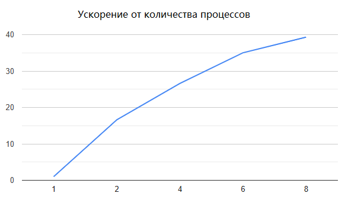
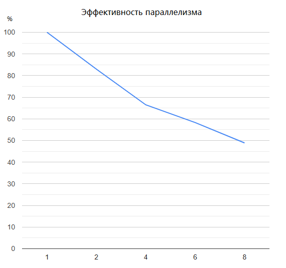

# Сортировка Шелла с простым слиянием.

- Студент: Шакирова Есения Андреевна, группа 3823Б1ПР2
- Технология: SEQ | MPI
- Вариант: 16


## 1. Введение

Сортировка массивов является одной из фундаментальных операций в информатике, широко применяемой в базах данных, поисковых системах, анализе данных и других областях. Алгоритм сортировки Шелла (Shell Sort) — это усовершенствованный метод сортировки вставками, который показывает хорошую производительность на средних и больших массивах данных.

В данной работе разработаны последовательная `SEQ` и параллельная `MPI` реализации алгоритма сортировки Шелла. Последовательная версия выполняет сортировку на одном процессоре, параллельная распределяет данные между процессами с использованием `MPI` и выполняет последующее слияние отсортированных подмассивов. Обе реализации интегрированы в фреймворк `PPC` и полностью протестированы.


## 2. Постановка задачи
**Задача:** Отсортировать массив целых чисел по возрастанию, используя алгоритм сортировки Шелла.

**Входные данные:** Неотсортированный массив целых чисел произвольного размера: ```using InType = std::vector<int>;```;

**Выходные данные:** Отсортированный массив целых чисел: ```using OutType = std::vector<int>;```


## 3. Описание алгоритма
### 3.1. Алгоритм сортировки Шелла

Сортировка Шелла — это обобщение сортировки вставками, которая сравнивает элементы, отстоящие друг от друга на определённом расстоянии (gap). Начиная с большого gap, алгоритм постепенно уменьшает его до 1, что эквивалентно обычной сортировке вставками.

**Основная идея:**
1. Выбирается начальный шаг (gap) = n/2
2. Элементы, отстоящие на gap позиций, сравниваются и при необходимости меняются местами
3. Gap уменьшается в 2 раза: gap = gap/2
4. Процесс повторяется до gap = 1
5. При gap = 1 выполняется обычная сортировка вставками, которая работает быстро на почти отсортированном массиве

```cpp
inline void ShellSortImpl(std::vector<int> &vec, int left, int right) {
  int n = right - left + 1;
  if (n <= 1) {
    return;
  }

  for (int gap = n / 2; gap > 0; gap /= 2) {
    for (int i = left + gap; i <= right; i++) {
      int temp = vec[i];
      int j = i;

      while (j >= left + gap && vec[j - gap] > temp) {
        vec[j] = vec[j - gap];
        j -= gap;
      }
      vec[j] = temp;
    }
  }
}
```

**Сложность:**
– Временная: `O(n^2)` в худшем случае;
– Пространственная: `O(1)`.


### 3.2. Базовый алгоритм (Последовательная версия SEQ)
**Алгоритм работы SEQ-версии:**

1. Валидация:
- Всегда возвращает `true`, так как любой массив может быть отсортирован;

2. Предобработка:
- Копирование входного массива в выходной: `GetOutput() = GetInput()`;

3. Основной цикл:
```cpp
  if (GetOutput().empty()) {
       return true; 
   }
   
   ShellSortImpl(GetOutput(), 0, GetOutput().size() - 1);
```

4. Постобработка:
- Возвращает `true` — дополнительная обработка не требуется.


### 3.3. Описание параллельного алгоритма (Версия MPI)

**Схема распараллеливания**

Параллельная версия основана на стратегии "разделяй и властвуй":
1. Массив разделяется между процессами
2. Каждый процесс независимо сортирует свою часть алгоритмом Шелла
3. Главный процесс последовательно сливает отсортированные части


**Распределение нагрузки:**

Распределение элементов между процессами выполняется статически на основе общего размера массива и количества MPI-процессов

```cpp
int base_count = total_elements / size;
int remainder = total_elements % size;

for (int i = 0; i < size; ++i) {
  send_counts[i] = base_count + (i < remainder ? 1 : 0);
  displs[i] = current_displ;
  current_displ += send_counts[i];
}
```
- Если n % P ≠ 0, первые remainder процессов получают на 1 элемент больше;
- Разница в нагрузке между процессами не превышает 1 элемента;

**Этапы работы параллельного алгоритма:**
- Синхронизация параметров `MPI_Bcast`:
```cpp
   if (rank == 0) {
     total_elements = GetInput().size();
   }
   MPI_Bcast(&total_elements, 1, MPI_INT, 0, MPI_COMM_WORLD);
```

- Распределение данных `MPI_Scatterv`:
```cpp
   MPI_Scatterv(
     rank == 0 ? GetInput().data() : nullptr,  // Источник (только на rank 0)
     send_counts.data(),                        // Размеры блоков
     displs.data(),                             // Смещения
     MPI_INT,
     local_vec.data(),                          // Локальный буфер
     send_counts[rank],                         // Размер локального буфера
     MPI_INT,
     0,                                         // Корневой процесс
     MPI_COMM_WORLD
   );

```

- Локальная сортировка:
```cpp
  if (!local_vec.empty()) {
     ShellSortImpl(local_vec, 0, local_vec.size() - 1);
   }
```

- Сбор данных `MPI_Gatherv`:
```cpp   
    MPI_Gatherv(
     local_vec.data(),                          // Локальные данные
     send_counts[rank],
     MPI_INT,
     rank == 0 ? GetOutput().data() : nullptr,  // Результат (только на rank 0)
     send_counts.data(),
     displs.data(),
     MPI_INT,
     0,
     MPI_COMM_WORLD
   );
```

- Слияние отсортированных частей:
```cpp
   auto current_end = GetOutput().begin() + send_counts[0];

   for (int i = 1; i < size; ++i) {
     if (send_counts[i] > 0) {
       auto next_end = current_end + send_counts[i];
       std::inplace_merge(GetOutput().begin(), current_end, next_end);
       current_end = next_end;
     }
   }
```

**Сложность:**
- Временная: `O((n/P)^2 + n × P)`:
- - `O((n/P)^2)` — локальная сортировка подмассива алгоритмом Шелла на каждом процессе;
- - `O(n × P)` — последовательное слияние P отсортированных подмассивов на корневом процессе;
- Пространственная: `O(n/P)` на каждом процессе


## 4. Детали реализации

#### 4.1. Тестирование и структура входных данных

Для проверки корректности работы последовательной `SEQ` и параллельной `MPI` реализаций алгоритма сортировки Шелла используются функциональные и performance-тесты, реализованные на основе фреймворка `Google Test` и утилит фреймворка `PPC`.

В качестве входных данных используется одномерный массив целых чисел:

```cpp
using InType = std::vector<int>;
using OutType = std::vector<int>;
```

Тестирование охватывает как заранее подготовленные наборы данных, так и автоматически сгенерированные массивы различного размера и содержания.


#### 4.1.1. Функциональные тесты

Функциональные тесты реализованы в классе `ShakirovaEShellsSortSimpleFuncTests`, который наследуется от базового класса фреймворка `PPC`:

```cpp
class ShakirovaEShellsSortSimpleFuncTests
  : public ppc::util::BaseRunFuncTests<InType, OutType, TestParams>
```

**Подготовка входных данных:** Входной массив извлекается из параметров теста в методе `SetUp`:
```cpp
void SetUp() override {
  input_data_ = std::get<
    static_cast<std::size_t>(ppc::util::GTestParamIndex::kTestParams)
  >(GetParam());
}
```

***Проверка корректности результата:** Проверка результата выполняется только на корневом процессе (rank = 0), что соответствует архитектуре MPI-реализации:
```cpp
bool CheckTestOutputData(OutType &output_data) final {
  int rank = 0;
  MPI_Comm_rank(MPI_COMM_WORLD, &rank);

  if (rank == 0) {
    std::vector<int> sorted_reference = input_data_;
    ShellSortImpl(sorted_reference, 0, sorted_reference.size() - 1);
    return output_data == sorted_reference;
  }
  return true;
}
```

В качестве эталона используется та же реализация сортировки Шелла, что исключает влияние сторонних библиотек и обеспечивает воспроизводимость результатов.


#### 4.1.2. Наборы тестовых данных

Функциональные тесты включают следующие категории входных данных:
- Пустой массив;
- Массив из одного элемента;
- Уже отсортированный массив;
- Массив, отсортированный в обратном порядке;
- Массив с повторяющимися элементами;
- Массивы с отрицательными числами;
- Массивы со значениями `INT_MIN` и `INT_MAX`;
- Случайно сгенерированные массивы.

Пример встроенного набора тестов:

```cpp
const std::array<TestParams, 11> kTestVectors = {
  TestParams{},
  TestParams{42},
  TestParams{9, 7, 5, 3, 1},
  TestParams{10, 20, 30, 40, 50, 60},
  TestParams{7, 7, 7, 7, 7},
  TestParams{-8, -3, -6, -1, -9},
  TestParams{INT_MAX, 0, INT_MIN}
};
```

#### 4.1.3. Загрузка тестов из файлов

Дополнительно поддерживается загрузка тестовых массивов из текстовых файлов, расположенных в каталоге `data/.`

Формат файла — две строки с целыми числами, разделёнными пробелами: 
- 1 строка - данный массив для сортировки;
- 2 строка - отсортированный массив;

```
-20 15 -10 25 0 -5 30
-20 -10 -5 0 15 25 30
```

Загрузка реализована следующим образом:

```cpp
std::vector<int> ReadVectorFromFile(const std::string &filename) {
  std::ifstream file(filename);
  std::vector<int> result;
  int value;

  while (file >> value) {
    result.push_back(value);
  }
  return result;
}
```

Такой подход позволяет легко добавлять новые тестовые примеры без изменения кода.


#### 4.1.4. Performance-тесты

Для оценки производительности реализованы performance-тесты в классе `ShakirovaEShellsSortSimplePerfTests`, унаследованном от:

```cpp
ppc::util::BaseRunPerfTests<InType, OutType>
```

**Генерация входных данных:** Входной массив большого размера генерируется автоматически

```cpp
const int count = 1500000;
input_data_.resize(count);

std::mt19937 gen(rd());
std::uniform_int_distribution<int> dist(-150000, 150000);
```

Размер массива выбран таким образом, чтобы продемонстрировать различия во времени выполнения между `SEQ` и `MPI`-реализациями.

**Проверка результата:** Корректность результата также проверяется на корневом процессе путём сравнения с эталонной сортировкой.


### 4.2.Интеграция с фреймворком PPC

Реализация алгоритма полностью интегрирована во фреймворк `PPC` и использует его базовые компоненты:
- `BaseTask` — базовый класс для вычислительных задач;
- `BaseRunFuncTests` — инфраструктура функциональных тестов;
- `BaseRunPerfTests` — инфраструктура performance-тестирования;
- автоматическую параметризацию тестов через `INSTANTIATE_TEST_SUITE_P`.

Обе версии алгоритма `SEQ` и `MPI` реализуют единый интерфейс задач `PPC`, что обеспечивает их взаимозаменяемость и упрощает сравнительный анализ.


## 5. Тестовое окружение
- Аппаратное обеспечение/Операционная система: Intel(R) Core(TM) i5 5200U, 2P+4E ядер, 8Gb Ddr3 1600Mhz, Windows 10, MS-MPI.
- Инструменты сборки: Cmake 4.2.0-rc4, Visual Studio 2022, MSVC, x64 Release.
- Переменные окружения и запуск тестов: Использовались настройки по умолчанию. Performance-тесты для `MPI` запускались с количеством процессов 1, 2, 4, 6 и 8 через `mpiexec`. Переменная `PPC_PERF_MAX_TIME` оставалась без изменений. Проверка корректности MPI-версии выполнялась на процессе с rank == 0.
- Данные для тестов: В функциональных тестах использовались как вручную подготовленные текстовые файлы из каталога `data/` (с массивами целых чисел и ожидаемыми отсортированными результатами), так и встроенные тестовые векторы. Для оценки производительности создавались случайные массивы больших размеров (до 1.5 млн элементов), что позволяло тестировать эффективность и масштабируемость `SEQ` и `MPI` версий алгоритма.


## 6. Результаты

### 6.1 Корректность

Корректность работы алгоритма сортировки Шелла была проверена с помощью функциональных тестов на различных типах массивов: пустых, одноэлементных, упорядоченных и обратных, с одинаковыми элементами, отрицательными числами, случайных и загруженных из файлов.

Во всех случаях последовательная и параллельная версии алгоритма давали идентичный результат, полностью совпадающий с эталонной сортировкой, выполненной через `ShellSortImpl`. Для MPI-версии проверка корректности производится только на основном процессе (`rank = 0`), что исключает возможные конфликты при распределённой обработке и обеспечивает точное сравнение с эталонным результатом.

Такой подход гарантирует стабильность и повторяемость результатов независимо от размера массива и способа его распределения между процессами.


### 6.2 Производительность
Время, ускорение, эффективность:

| Режим | Кол-во процессов | Время, сек | Ускорение | Эффективность параллелизма |
|-------|-----------------|------------|-----------|----------------------------|
| SEQ   | 1               | 26 376.7   | 1.00      | N/A                        |
| MPI   | 2               | 1 587      | 16.6      | 83.0%                      |
| MPI   | 4               | 990        | 26.6      | 66.5%                      |
| MPI   | 6               | 753        | 35.0      | 58.3%                      |
| MPI   | 8               | 674        | 39.1      | 48.9%                      |

|         Ускорение от количества процессов         |         Эффективность параллелизма         |
|---------------------------------------------------|--------------------------------------------|
|  |    |


1. **Ускорение MPI-версии:**  
   MPI-реализация сортировки Шелла демонстрирует значительное ускорение по сравнению с последовательной реализацией. Уже при 2 процессах ускорение достигает ~16×, что очень заметно.

2. **Эффективность параллельной работы:**  
   - При 2–4 процессах эффективность остаётся высокой (≈66–83%). Это объясняется тем, что накладные расходы на пересылку данных ещё невелики по сравнению с объёмом вычислений.  
   - При 6–8 процессах эффективность падает до ≈49–58%, так как основное время начинает уходить на коммуникацию между процессами и управление буферами MPI, а не на вычисления.


## 8. Заключение

Были реализованы последовательная и MPI-версии сортировки Шелла. Функциональные тесты подтвердили корректность работы обеих версий.  
Производительность MPI-версии значительно повышается при использовании 2–4 процессов, однако при 6–8 процессах эффективность падает из-за накладных расходов на пересылку данных и особенностей работы MPI в Windows.  
Таким образом, MPI-реализацию целесообразно использовать при небольшом числе процессов, когда можно получить заметное ускорение без значительной потери эффективности.

## 9. Источники
1. Курс лекций "Параллельное программирование" Сысоева Александра Владимировича 
2. Документация по курсу: https://learning-process.github.io/parallel_programming_course/ru
3. Курс лекций "Параллельная обработка данных": https://parallel.ru/vvv/mpi