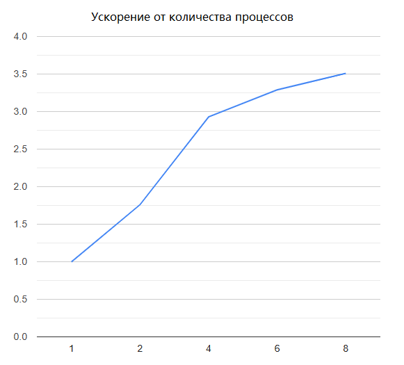
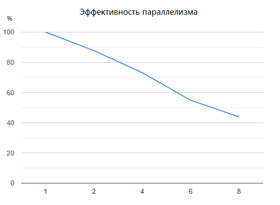

# Метод простой итерации

- Студент: Шакирова Есения Андреевна, группа 3823Б1ПР2
- Технология: SEQ | MPI
- Вариант: 20


## 1. Введение

Решение систем линейных алгебраических уравнений (СЛАУ) является фундаментальной задачей вычислительной математики, возникающей в научных расчётах, инженерных приложениях, обработке данных и машинном обучении. Метод простой итерации — один из классических итерационных методов решения СЛАУ, особенно эффективный для систем с диагональным преобладанием.

В данной работе разработаны последовательная (SEQ) и параллельная (MPI) реализации метода простой итерации для решения СЛАУ вида `Ax = b`. Последовательная версия выполняет итерации на одном процессоре, параллельная распределяет вычисления между процессами с использованием MPI. Обе реализации интегрированы в фреймворк PPC и полностью протестированы.


## 2. Постановка задачи
Дана система линейных уравнений `Ax = b`, где:
`A` — квадратная матрица коэффициентов размера `n × n` с диагональным преобладанием
`b` — вектор правых частей размера `n`
`x` — искомый вектор решения размера `n`. 
Для данной системы уравнений требуется вычислить значения искомого вектора.

**Входные данные:** Система линейный алгебраических уравнений.  ```using InType = LinearSystem;```;

```cpp
struct LinearSystem {
  size_t n;                    // Размерность системы
  Matrix A;                    // Матрица коэффициентов (n×n)
  std::vector<double> b;       // Вектор правых частей
  double epsilon = 1e-6;       // Точность сходимости
  size_t max_iterations = 1000; // Максимальное число итераций
};
```

**Выходные данные:** Искомый вектор: ```using OutType = std::vector<double>```


## 3. Описание алгоритма

Метод простой итерации преобразует систему `Ax = b` к виду `x = Bx + c`, где:
```
B[i][j] = -A[i][j] / A[i][i]  при i ≠ j
B[i][i] = 0
c[i] = b[i] / A[i][i]
```

Итерационная формула: ``` x^(k+1) = Bx^(k) + c ```

Условие сходимости: `||B|| < 1` - норма матрицы B меньше единицы
Критерий останова: `||x^(k+1) - x^(k)|| < ε` - достижение максимального числа итераций

### 3.1. Базовый алгоритм (Последовательная версия SEQ)

**Алгоритм работы SEQ-версии:**

1. Валидация:
- Проверка корректности размерности системы;
- Проверка ненулевых диагональных элементов;
- Проверка диагонального преобладания;
- Вычисление нормы матрицы B и проверка условия сходимости;

2. Предобработка:
- Инициализация вектора решения нулями;
- Преобразование системы к итерационному виду;

3. Основной цикл:
```cpp
  while (true) {
    for (size_t row = 0; row < dimension; ++row) {
      xNext[row] = cVector[row];
      for (size_t col = 0; col < dimension; ++col) {
        xNext[row] += bMatrix.At(row, col) * xCurrent[col];
      }
    }

    std::vector<double> difference(dimension, 0.0);
    for (size_t idx = 0; idx < dimension; ++idx) {
      difference[idx] = xNext[idx] - xCurrent[idx];
    }

    convergenceError = LinearSystem::VectorNorm(difference);

    xCurrent = xNext;
    iterCount++;

    if (convergenceError <= input.epsilon || iterCount >= input.max_iterations) break;
  }
```

4. Постобработка:
Проверка невязки:  `||Ax - b|| < ε × 10`.

**Сложность:**
- Временная: `O(k × n)`, где `k` — число итераций;
- ППространственная: `O(n^2)` для матрицы `B`.


### 3.2. Описание параллельного алгоритма (Версия MPI)

**Схема распараллеливания**

Параллельная версия метода простых итераций реализована с использованием библиотеки `MPI` и основана на строчном разбиении матрицы итераций `B`.

Каждому MPI-процессу назначается подмножество строк матрицы `B` и соответствующие элементы вектора `c`.
На каждой итерации каждый процесс вычисляет свою часть нового приближения вектора решения `x`.


**Распределение нагрузки:**

Распределение строк матрицы между процессами выполняется динамически, исходя из общего числа уравнений и количества MPI-процессов:

```cpp
int base_rows = dimension / world_size;
int extra_rows = dimension % world_size;

for (int proc = 0; proc < world_size; ++proc) {
  rows_per_proc[proc] = (proc < extra_rows) ? (base_rows + 1) : base_rows;
  displacements[proc] = current_offset;
  current_offset += rows_per_proc[proc];
}
```
Если число строк матрицы не делится нацело на количество процессов, оставшиеся строки распределяются между первыми процессами. Таким образом, разница в количестве обрабатываемых строк между процессами не превышает одной строки, что обеспечивает равномерную балансировку нагрузки.

**Этапы работы параллельного алгоритма:**
- Синхронизация параметров `MPI_Bcast`:
- - Размерность системы `n`;
- - Точность `ε`;
- - Максимальное число итераций.

- Распределение данных `MPI_Scatterv`:
- - Строки матрицы `B`;
- - Элементы вектора `c`.

- Итерационный процесс:
```cpp
do {
    MPI_Bcast(x_current.data(), dimension, MPI_DOUBLE, 0, MPI_COMM_WORLD);
    
    for (int local_row = 0; local_row < local_rows; ++local_row) {
      local_results[local_row] = c_local[local_row];
      
      for (size_t col = 0; col < dimension; ++col) {
        local_results[local_row] += B_local[local_row * dimension + col] * x_current[col];
      }
    }
    
    MPI_Gatherv(local_results.data(), local_rows, MPI_DOUBLE,
                x_next.data(), rows_per_proc.data(), displacements.data(), 
                MPI_DOUBLE, 0, MPI_COMM_WORLD);
    
    if (world_rank == 0) {
      convergence_error = 0.0;
      for (size_t idx = 0; idx < dimension; ++idx) {
        double delta = std::abs(x_next[idx] - x_current[idx]);
        if (delta > convergence_error) {
          convergence_error = delta;
        }
      }
      x_current = x_next;
    }
    
    MPI_Bcast(&convergence_error, 1, MPI_DOUBLE, 0, MPI_COMM_WORLD);
    
    iter_count++;
    
  } while (convergence_error > tolerance_val && iter_count < max_iterations);
  ```

**Сложность:**
- Временная: `O(k * n^2 /P + k × log P)` :
- - `O(k × n^2/P)` — локальные вычисления
- - `O(k × log P)` — коммуникационные затраты
- Пространственная: `O(n^2/P)` на каждом процессе


## 4. Детали реализации

#### 4.1.1. Структура данных LinearSystem

Для функциональных тестов входные данные загружаются из текстовых файлов, расположенных в каталоге `data/`. Каждый файл содержит описание системы линейных уравнений в читаемом формате: размерность системы, коэффициенты уравнений и ожидаемое решение. Такой подход обеспечивает автоматическую проверку корректности работы алгоритма на заранее подготовленных тестовых примерах.

Механизм загрузки использует функцию `GetAbsoluteTaskPath` для формирования абсолютного пути к тестовым файлам, что гарантирует корректное их нахождение независимо от текущей рабочей директории и обеспечивает воспроизводимость тестов в различных средах выполнения (локальная разработка, CI/CD pipeline).


#### 4.1.2. Структура данных LinearSystem

Центральной структурой данных является `LinearSystem`, инкапсулирующая всю информацию о системе уравнений и параметрах решения:

```cpp
struct LinearSystem {
  size_t n;
  Matrix A;                    // Хранение: data[i*n + j]
  std::vector<double> b;
  std::vector<double> x;
  double epsilon = 1e-6;
  size_t max_iterations = 1000;
  
  bool HasDiagonalDominance() const;
  bool TransformToIterationForm(Matrix& B, std::vector<double>& c) const;
  static double VectorNorm(const std::vector<double>& v);
  double MatrixNorm(const Matrix& M) const;
};
```

**Особенности реализации Matrix:**
- Одномерное хранение элементов (`data[i*n + j]`) для эффективной пересылки через MPI
- Методы доступа `At(i, j)` для удобства работы с двумерной индексацией
- Проверка корректности размерности через `IsValid()`


#### 4.1.2. Тестовые данные

Формат тестовых файлов (data/test_N.txt):
```
n n
a11*x1 + a12*x2 + ... = b1
a21*x1 + a22*x2 + ... = b2
...
x1 = sol1, x2 = sol2, ...
```

#### 4.1.3.  Генерация тестовых данных для Performance-тестов:

Для оценки производительности используется автоматическая генерация систем с гарантированной сходимостью:

```cpp

static LinearSystem GenerateTestSystem(size_t n) {
  Matrix A(n, n);
  std::vector<double> b(n);

  for (size_t i = 0; i < n; ++i) {
    double row_sum = 0.0;
    
    for (size_t j = 0; j < n; ++j) {
      if (i != j) {
        A.At(i, j) = 1.0;
        row_sum += 1.0;
      }
    }
    
    A.At(i, i) = row_sum * 5.0;
    
    b[i] = A.At(i, i) + row_sum;
  }

  LinearSystem system(A, b);
  system.epsilon = 1e-6;
  system.max_iterations = 10000;

  return system;
}
```

**Математическое обоснование:**
- Коэффициент диагонального преобладания: 5:1
- Норма матрицы B: `||B|| = (n-1)/(5×(n-1)) = 0.2 < 1` 
- Ожидаемое число итераций: ≈ 15-25
- Решение: x = [1, 1, ..., 1] — легко проверяется

**Преимущества подхода:**
- Гарантированная сходимость для любого размера n
- Предсказуемое время выполнения
- Простая проверка корректности результата
- Масштабируемость до больших размерностей (протестировано до n=500)

### 4.2. Интеграция с фреймворком PPC

Реализация использует базовые классы и утилиты фреймворка PPC:
- `BaseTask` — базовый класс для задач с методами жизненного цикла
- `BaseRunFuncTests` — базовый класс для функциональных тестов
- `BaseRunPerfTests` — базовый класс для performance-тестов
- Автоматическая регистрация тестов через `INSTANTIATE_TEST_SUITE_P`


## 5. Тестовое окружение

- Аппаратное обеспечение/Операционная система: Intel(R) Core(TM) i5 5200U, 2P+4E ядер, 8Gb Ddr3 1600Mhz, Windows 10, MS-MPI.
- Инструменты сборки: Cmake 4.2.0-rc4, Visual Studio 2022, MSVC, x64 Release.
- Переменные окружения: Использовались настройки по умолчанию. Performance-тесты для MPI запускались с количеством процессов 1, 2, 4, 6 и 8 через `mpiexec`, переменная `PPC_PERF_MAX_TIME` не изменялась.
- Данные: В функциональных тестах использовались вручную подготовленные текстовые файлы из каталога `data/`, содержащие количество переменных и число уравнений, саму систему уравнений и ожидаемые результаты. Для оценки производительности автоматически генерируется система `500×500`.


## 6. Результаты

### 6.1 Корректность

Корректность работы реализации метода простой итерации была подтверждена с помощью набора функциональных тестов, включающих системы линейных уравнений различного размера и структуры.

В тестировании использовались:
- Малые системы;
- Случайно сгенерированные матрицы большого размера (500×500), с диагональным преобладанием, обеспечивающие сходимость метода.

Во всех случаях последовательная и параллельная версии давали одинаковый корректный результат в пределах погрешности `ε = 1e-6`.

Проверка производилась с использованием функции CheckTestOutputData, которая сравнивает вычисленные решения с ожидаемым вектором единиц. Для MPI-версии проверка корректности учитывает только основной процесс `rank = 0`, что исключает конфликты при распределённой обработке.


### 6.2 Производительность

Время, ускорение, эффективность:

| Режим       | Кол-во процессов | Время, сек | Ускорение | Эффективность параллелизма |
|-------------|-------|---------|---------|------------|
| SEQ         | 1     | 0.527  | 1.00    | N/A        |
| MPI         | 2     | 0.300  | 1.76    | 87.8%      |
| MPI         | 4     | 0.180  | 2.93    | 73.2%      |
| MPI         | 6     | 0.160  | 3.29    | 54.9%      |
| MPI         | 8     | 0.150  | 3.51    | 43.9%      |


|         Ускорение от количества процессов         |         Эффективность параллелизма         |
|---------------------------------------------------|--------------------------------------------|
|  |    |


Проанализировав результаты, можно сказать, что `MPI-версия` метода простой итерации даёт ускорение по сравнению с последовательной реализацией, но эффективность параллельной работы снижается, когда увеличивается число процессов. При `2–4 процессах` ускорение достаточно заметное, а эффективность остаётся высокой `73–88%`, потому что накладные расходы на пересылку данных ещё не слишком большие.

Когда число процессов растёт до `6–8`, ускорение продолжает увеличиваться, но эффективность падает почти вдвое до `44%`. Это происходит из-за того, что вычислений на каждом процессе не так много по сравнению с объёмом передаваемых данных. Основное время начинает уходить на пересылку данных между процессами и на выделение больших буферов в Windows MPI для операций `Scatterv`, поэтому параллельное выполнение уже не так выгодно.

Таким образом, при небольшом количестве процессов можно получить хорошее ускорение без большой потери эффективности, но при дальнейшем увеличении числа процессов эффективность падает из-за накладных расходов на коммуникацию и особенностей MPI в Windows.


## 8. Заключение

Была реализована последовательная и MPI-версия метода простой итерации для решения систем линейных уравнений. Тесты подтвердили корректность работы обеих версий.

Производительность MPI повышается при 2–4 процессах, но при 6–8 процессах эффективность падает из-за накладных расходов на пересылку данных и ограничений памяти. Следовательно, MPI эффективно использовать только для небольшого числа процессов.


## 9. Источники

1. Курс лекций "Параллельное программирование" Сысоева Александра Владимировича 
2. Документация по курсу: https://learning-process.github.io/parallel_programming_course/ru
3. Курс лекций "Численные методы" Федоткина Андрея Михайловича
4. Курс лекций "Параллельная обработка данных": https://parallel.ru/vvv/mpi

